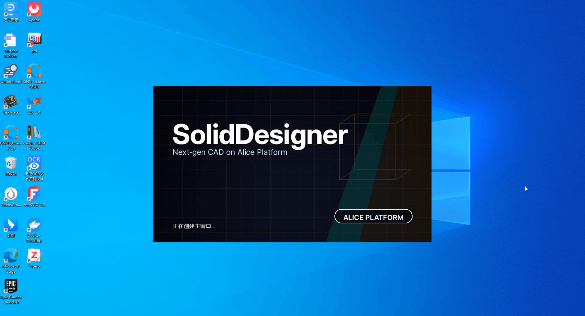

<p align="center">
  
</p>

<p align="center">
  <a href="LICENSE"></a>
  
  
  
  
</p>

<p align="center">
  <b>Plataforma de código abierto de nivel de ingeniería para CAD paramétrico y diseño impulsado por simulación</b><br/>
  Modelado basado en features • Modelo de datos preparado para CAE • Arquitectura orientada a la optimización
</p>

<p align="center">
  
</p>

<p align="center">
  Vista previa de la demo del producto
</p>

## [English](README.md) | [日本語](README.ja.md) | [Français](README.fr.md) | [Deutsch](README.de.md) | [Español](README.es.md) | [Русский](README.ru.md)

> Objetivo: un sistema de nivel profesional que admita modelado sólido/superficial, ensamblajes, dibujo técnico, mecánica estructural, CFD, multifísica y optimización, donde las simulaciones puedan impulsar el propio diseño.

---

## Quick Links

- **Tablero JIRA**: https://hananiah.atlassian.net/jira/software/c/projects/AL/boards/3
- **Wiki público (GitHub)**: https://github.com/hananiahhsu/SolidDesignerWiki
- **Wiki de diseño (Confluence, requiere acceso)**: https://hananiah.atlassian.net/wiki/spaces/~5e2301040f45160ca25e42e3/overview?homepageId=65963

---

## Table of Contents

- [Visión y alcance](#vision--scope)
- [Resumen del producto](#product-overview)
- [Qué incluye](#whats-in-the-box)
- [Estructura del proyecto y arquitectura](#project-layout--architecture)
- [Conceptos clave](#core-concepts)
- [Capacidades](#capabilities)
- [Hoja de ruta](#roadmap)
- [Compilar y ejecutar](#build--run)
- [Dependencias](#dependencies)
  - [Stack open source y licencias](#open-source-stack--licenses)
- [Primeros pasos](#getting-started)
- [Plugins y scripting](#plugin--scripting)
- [Datos y formatos de archivo](#data--file-formats)
- [Diagnóstico, logging y QA](#diagnostics-logging--qa)
- [Contribuir](#contributing)
- [Licencia](#license)
- [Agradecimientos](#acknowledgments)
- [FAQ](#faq)

---

## Vision & Scope

SolidDesigner aspira a ser una plataforma CAD/CAE **full‑stack y de grado de ingeniería**:

- **Parametric CAD**: modelado robusto de piezas/ensamblajes, sketches/restricciones, features basadas en historial y dibujo técnico.
- **CAE**: solucionadores integrados y/o adaptadores para **mecánica estructural (FEA)**, **dinámica de fluidos (CFD)** y **multifísica**.
- **Optimization**: optimización **topológica / de forma / de tamaño**, refuerzo/reducción de peso y bucles de diseño impulsados por simulación.
- **AI Assistance**: un “copiloto” de ingeniería para inferencia de restricciones, detección de intención de features, exploración del espacio de diseño y sugerencias de configuración de solver.
- **Extensibility**: arquitectura modular con una API estable de plugins y scripting.

> **Status**: desarrollo activo (pre‑alpha). Las API y los formatos de archivo pueden cambiar.

---

## Product Overview

SolidDesigner (marca: **Breptera**) es una aplicación CAD **de escritorio y orientada a workbenches**, construida sobre la plataforma reutilizable **Alice**.

<p align="center">
  
</p>

**Objetivos para el usuario**

- **Workflow**: workbenches, comandos de ribbon, paneles acoplables y viewports MDI.
- **Parametric foundation**: árbol de historial de features, sketches/restricciones y pipeline de rebuild & regeneration (WIP).
- **Engineering-first**: modelo de datos CAD diseñado para transportar **materiales, cargas/BC, controles de mallado y resultados de análisis** (previsto).
- **Kernel-backed geometry**: B‑Rep y visualización por defecto mediante **OpenCascade (OCCT)**; el render multibackend está soportado a nivel de plataforma.

> La captura anterior refleja la dirección actual de la interfaz (Home Workbench + panel de descubrimiento/aprendizaje). El diseño exacto evoluciona rápidamente durante la fase pre‑alpha.

---

## What’s in the Box

- Una base de código moderna en C++17/20 con un **submódulo de foundation (“Alice”)**.
- Una **aplicación de escritorio** (“SolidDesigner”) construida sobre esa foundation.
- Una separación clara entre las capas **Core / Data / Interaction / UI**.
- Implementaciones tempranas del **grafo de features**, las **restricciones paramétricas**, el **diagnóstico/logging** y el **hosting de plugins**.
- Un plan a largo plazo para **solvers CAE** (FEA/CFD) y **optimización**.

---

## Project Layout & Architecture

**Physical Structure**

```
Physical Structure
    |
    |----- Alice  (submodule)
    |         |
    |         |---- Bootstrap
    |         |---- Core
    |         |---- Data
    |         |---- Interaction
    |         |---- UI
    |
    |----- SolidDesigner  (application)
              |
              |-- APP
              |-- DATA
              |-- Interaction
              |-- UI
              |-- Plugins
```

### Layered Architecture (high‑level)

- **Alice/Core** — primitivas de plataforma y utilidades base (memoria, threading, diagnóstico, matemáticas, unidades, abstracciones geométricas).
- **Alice/Data** — modelo paramétrico, grafo de features/operaciones, sistema de restricciones y cotas, servicios de documento/sesión.
- **Alice/Interaction** — selección/picking, manipuladores, pipeline de comandos, transacciones undo/redo y grafo de interacción.
- **Alice/UI** — shell basado en Qt (previsto), paneles acoplables, explorador de propiedades y ribbon/menús/atajos.
- **SolidDesigner/APP** — la capa de producto: ciclo de vida de la aplicación, persistencia, proyecto/workspace, plugins y scripting.
- **SolidDesigner/DATA/Interaction/UI** — extensiones específicas del producto sobre las capas de Alice.

> El submódulo **Alice** está pensado para ser reutilizable y con filosofía de engine; **SolidDesigner** lo compone para formar un producto completo.

---

## Core Concepts

- **Feature Graph**: todas las operaciones de modelado (Sketch, Extrude, Revolve, Fillet, Pattern, Boolean, etc.) son nodos de un grafo acíclico dirigido con **historial y dependencias**. Los rebuilds se propagan de forma determinista.
- **Constraint System**: restricciones geométricas y dimensionales con backends de solver (hoy restricciones de sketch; restricciones 3D previstas).
- **Parametric Design**: parámetros con nombre (cotas, materiales, BC) pueden gobernar tanto la geometría como el análisis; soporta expresiones y unidades.
- **Simulation‑Driven Design**: los análisis evalúan diseños candidatos; los resultados retroalimentan los parámetros (por ejemplo, reducir peso automáticamente hasta cumplir objetivos de tensión).
- **Multi‑representation Geometry**: abstracciones de sólido/superficie/B‑Rep con tolerancias, generación de malla para análisis y consistencia CAD↔CAE.
- **Transactions**: cada comando se ejecuta dentro de una transacción; undo/redo completo; mensajes de error útiles a través del motor de diagnóstico.

---

## Capabilities

### CAD (current/planned)

- Sketching con restricciones y cotas
- Modelado basado en historial: extrude/revolve/sweep/loft, fillet/chamfer, shell, pattern, operaciones booleanas
- Ensamblaje: mates/restricciones; contexto top‑down (WIP)
- Dibujo técnico: vistas, secciones, cotas, GD&T (previsto)

### CAE (current/planned)

- **Structural (FEA)**: estático lineal, modal; biblioteca de materiales; condiciones de contorno; controles de mallado (expansión iterativa prevista)
- **CFD**: flujos incompresibles (estacionario/transitorio); modelos de turbulencia; condiciones de contorno (previsto)
- **Multiphysics**: termo‑estructural, FSI (largo plazo)

### Optimization (planned)

- Optimización topológica (SIMP/level‑set)
- Optimización de forma/tamaño; restricciones (tensión, desplazamiento, frecuencia, pérdida de presión, etc.)
- Exploración del espacio de diseño; modelos sustitutos

### AI Assistance (planned)

- Inferencia de intención de restricciones/features a partir de acciones del usuario
- Autocompletado de comandos; sugerencias de parámetros
- Recomendación del espacio de diseño; DOE automático
- Sugerencias de configuración de solver y mallado según el contexto

> Consulte **[Roadmap](#roadmap)** y **JIRA** para el progreso detallado por ítem.

---

## Roadmap

La planificación y el backlog se siguen en **JIRA**:  
https://hananiah.atlassian.net/jira/software/c/projects/AL/boards/3

Hitos de alto nivel (sujetos a cambios):

1. **P0 — Modeling Foundations**: grafo de features estable, sketcher robusto, operaciones básicas de modelado, sistema de transacciones y persistencia.
2. **P1 — Meshing & FEA MVP**: pipeline de malla tet/hex; estático lineal/modal; postproceso básico.
3. **P2 — CFD MVP**: integración de malla y solver para flujos incompresibles; campos de presión/velocidad/temperatura; postproceso.
4. **P3 — Optimization**: optimización topológica SIMP; actualizaciones paramétricas en lazo cerrado; manejo de restricciones.
5. **P4 — AI Copilot v1**: inferencia de restricciones, sugerencias de comandos, presets de solver; aprendizaje a partir del historial del proyecto.

Los documentos de diseño detallados viven en **Confluence** (requiere acceso). Un subconjunto público vive en el **Wiki de GitHub**.

---

## Build & Run

Este repositorio incluye **scripts de compilación con un clic** que generan un árbol de build bajo `../SolidDesigner_Build/`.

### Prerequisites (current)

- **CMake ≥ 3.31**  
  - Windows: el repositorio incluye CMake en `ToolChain/cmake` (usado por `AutoGenerateVsProject.bat`)  
  - Linux: instale una versión reciente de CMake en el sistema (o use su propia toolchain)
- **C++17 toolchain**: MSVC v143 / GCC 11+ / Clang 15+
- **Qt 5.15.x** con módulos: Core, Gui, Widgets, Network, Quick, Qml
- **OpenCascade (OCCT) SDK** para el backend del visor OCCT (vea la disposición del SDK más abajo)

### Windows (Visual Studio 2022, x64)

1. Clonar con submódulos:

```bash
git clone --recurse-submodules https://github.com/hananiahhsu/SolidDesigner.git
cd SolidDesigner
```

2. Ejecutar:

- `AutoGenerateVsProject.bat` (genera `../SolidDesigner_Build/SolidDesigner.sln` y abre Visual Studio)

3. Compilar la configuración `Release|x64` en Visual Studio y luego ejecutar `SolidDesigner`.

### Linux (Makefiles)

Ejecutar:

```bash
./SolidDesignerForLinux.sh
```

Este script configura y compila usando `Unix Makefiles` y escribe la salida en `../SolidDesigner_Build/`.

> Nota: actualmente el script pasa `-DCMAKE_GENERATOR_PLATFORM=x64`, que es una opción de Visual Studio y puede ser ignorada por las toolchains de Linux. Si encuentra problemas, ejecute CMake manualmente (sección siguiente).

### Manual CMake (recommended when customizing toolchains)

```bash
cmake -S . -B ../SolidDesigner_Build -G "Ninja" -DCMAKE_BUILD_TYPE=Release
cmake --build ../SolidDesigner_Build --parallel
```

### Third‑party SDK layout (OCCT)

El backend del visor OCCT espera que el SDK de OpenCascade esté exportado a:

```
Externals/3rdParty/sdk/<platform>/<Debug|Release>/occt
```

Valores predeterminados de `<platform>` (se pueden sobrescribir):

- Windows: `msvc2022-x64-md`
- Linux: `linux-x64`

Puede sobrescribirlos desde CMake:

- `-DSD_3P_PLATFORM=...`
- `-DSD_3P_CFG=Debug|Release`
- o apuntar directamente `-DOpenCASCADE_DIR=...` a la carpeta que contiene `OpenCASCADEConfig.cmake`.

### Qt

Los targets de UI usan actualmente **Qt 5** (por ejemplo `Qt5::Core`, `Qt5::Widgets`, `Qt5::Quick/Qml` en CMake).  
En Windows, algunos módulos establecen un `CMAKE_PREFIX_PATH` predeterminado para `Qt5.15.x`; ajústelo a su instalación local de Qt si es necesario.

---

## Dependencies

El proyecto es modular: algunas bibliotecas están **vendorizadas dentro del árbol**, mientras que otras se esperan como **SDK externos**.

### Open-source Stack & Licenses

| Biblioteca | Uso | Ubicación | Licencia (upstream) |
|---|---|---|---|
| **OpenCascade (OCCT)** | Kernel B‑Rep + backend del visor OCCT | `Alice/Core/Runtime/AliceRenderBackendOCCViewer` | LGPL‑2.1 with OCCT exception (upstream) |
| **Qt 5 (Widgets/Quick/Qml)** | UI de escritorio (ribbon, paneles, diálogos) | `Designer/UI/*`, `Alice/UI/QFrameWork/*` | GPL/LGPL/commercial (Qt) |
| **spdlog** | Backend de logging | `Alice/Core/Foundation/AliceBasicTool/*SpdLog*` | MIT |
| **fmt** | Formateo de cadenas | `Alice/Core/Foundation/AliceBasicTool/*Fmt*` | MIT |
| **Open Sans** | Activos tipográficos para el ribbon | `Alice/UI/QFrameWork/AliceRibbon/OpenSans` | Apache‑2.0 |
| | | | |
| | | | |

> **Nota de licencia**: SolidDesigner es **GPLv3**, pero algunas dependencias integradas/requeridas son LGPL/MIT/Apache. Al distribuir binarios, debe cumplir con cada licencia upstream (obligaciones de enlace dinámico, avisos, disponibilidad del código fuente, etc.).

### Optional / planned adapters (not required for a minimal build)

- Existen backends de render **OGRE / OSG / VTK / Skylark** como módulos de plataforma (`Alice/Core/Runtime/AliceRenderBackend*`), pero pueden requerir SDK adicionales y siguen evolucionando.
- Los **malladores / solvers** (FEA/CFD/optimización) están en diseño activo; los adaptadores se introducirán de forma incremental.

---

## Getting Started

Flujo de trabajo típico previsto (estado objetivo):

1. **Crear un proyecto** y establecer unidades/tolerancias predeterminadas.
2. **Dibujar un sketch** sobre un plano; usar restricciones/cotas.
3. Crear features: **Extrude**, **Revolve**, **Fillet**, **Shell**, **Pattern**…
4. **Ensamblar** las piezas; añadir mates/restricciones.
5. **Mallado** del modelo (controles globales + locales).
6. Definir **materiales** y **condiciones de contorno**.
7. Ejecutar **FEA/CFD**; inspeccionar tensiones/deformaciones, modos y campos de flujo.
8. **Conducir parámetros** a partir de los resultados (por ejemplo, reducir espesor hasta que la tensión ≤ objetivo).
9. Guardar como **proyecto** y exportar a **STEP/IGES** o formatos de malla.

---

## Plugin & Scripting

- **Plugin ABI**: interfaces limpias en C++ para operaciones geométricas, mallado, solvers, importadores/exportadores y add-ins de UI.
- **Isolation**: modelo de ownership estable y seguridad entre DLLs (la foundation proporciona utilidades de punteros Owning/Weak/Guard).
- **Scripting (planned)**: API de Python para automatizar modelado, configurar estudios, postprocesar resultados y orquestar bucles de diseño.
- **AI hooks (planned)**: registrar asesores de diseño personalizados y modelos ML para predicción de intención y optimización.

---

## Data & File Formats

### Native project format (in progress)

El formato nativo está pensado para ser:

- **Structured**: metadatos + cargas tipadas (geometría, malla, resultados, miniaturas, etc.)
- **Versioned**: versionado de esquema con un pipeline explícito de actualización
- **Incremental-friendly**: diseñado para recarga parcial y futuros flujos de trabajo cloud/workspace
- **Stable-identity aware**: los IDs de objeto sobreviven a guardar/cargar, copiar/pegar y actualizaciones

> El wiki público alojará la especificación canónica una vez que el formato se estabilice.

### Interoperability (planned / incremental)

- **CAD Interop**: importación/exportación STEP/IGES (otros formatos mediante adaptadores)
- **Mesh/Results**: formatos estándar de malla/resultados para solvers/post externos (VTK, MED, etc., previsto)
- **Units**: sistema de unidades coherente con metadatos explícitos; parámetros dimensionados en expresiones

---

## Diagnostics, Logging & QA

- **DiagnosticsEngine** unificado con niveles de severidad, ubicaciones de origen y sinks conectables (consola, archivo, panel UI).
- Backend **spdlog** opcional para logging rápido y consciente de hilos.
- **Assertions** y **comprobaciones defensivas** a través de fronteras de DLL.
- **Testing** mediante CTest; fixtures para geometría, mallado y corrección del solver; casos reproducibles adjuntos a JIRA.

---

## Contributing

Las contribuciones son bienvenidas.

- Revise las épicas/tareas de JIRA y el Wiki de GitHub para obtener contexto.
- Discuta propuestas más grandes antes de abrir una PR.
- Siga el estilo de código del proyecto (archivo clang-format previsto) e incluya pruebas unitarias.
- Mantenga los commits pequeños y bien descritos; vincúlelos con tickets de JIRA cuando corresponda.

Primeras contribuciones sugeridas:

- Corregir problemas de build en una plataforma/compilador concreto
- Añadir pruebas enfocadas (geometría, persistencia, resolución de restricciones)
- Añadir documentación: notas de diseño, diagramas o secciones mínimas de “how it works”

> Documentación de contribución a nivel de repositorio (prevista): `CONTRIBUTING.md`, `CODE_OF_CONDUCT.md`.

---

## License

Este repositorio está licenciado bajo **GNU GPL v3.0**. Consulte `LICENSE` para el texto completo.

> Nota: las bibliotecas de terceros pueden tener sus propias licencias; asegúrese de cumplirlas al redistribuir binarios.

---

## Acknowledgments

Este proyecto se apoya en gigantes: OpenCascade, Eigen, fmt, spdlog, Qt y la comunidad open source en general.  
Gracias especialmente a los contribuidores e investigadores de CAD/CAE/CFD/optimización.

---

## FAQ

**¿Existe una API de scripting?**  
Hay una API de Python planificada. Ya existe una estructura interna inicial; la API pública llegará próximamente.

**¿Qué stack de solvers se utiliza?**  
Se están prototipando solvers internos. También se planean adaptadores para solvers externos (por ejemplo, malladores/post).

**¿Las funciones de IA requerirán acceso a internet?**  
No. La intención es soportar inferencia offline con modelos locales, con integraciones cloud opcionales.

**¿Dónde puedo seguir el progreso?**  
JIRA (roadmap/backlog) y el Wiki público de GitHub. Los documentos de diseño detallados están en Confluence (requiere acceso).
