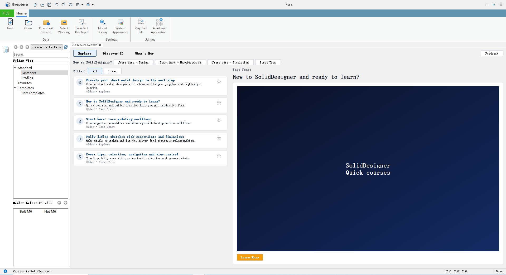

<p align="center">
  
</p>


<p align="center">
  <a href="LICENSE"></a>
  
  
  
  
</p>

# SolidDesigner

**パラメトリック CAD、高忠実度 CAE、トポロジー最適化のためのオープンソース・プラットフォーム — シミュレーション駆動設計と AI アシストを統合。**

> 目標：Creo Parametric に匹敵するプロフェッショナル級システムとして、ソリッド／サーフェスモデリング、アセンブリ、製図、構造力学、CFD、マルチフィジックス、最適化をサポートし、シミュレーションが設計そのものを駆動できるようにする。

---

## Quick Links

- **JIRA ボード**: https://hananiah.atlassian.net/jira/software/c/projects/AL/boards/3
- **公開 Wiki（GitHub）**: https://github.com/hananiahhsu/SolidDesignerWiki
- **設計 Wiki（Confluence／要アクセス権）**: https://hananiah.atlassian.net/wiki/spaces/~5e2301040f45160ca25e42e3/overview?homepageId=65963

---

## Table of Contents

- [ビジョンとスコープ](#vision--scope)
- [製品概要](#product-overview)
- [同梱内容](#whats-in-the-box)
- [プロジェクト構成とアーキテクチャ](#project-layout--architecture)
- [コア概念](#core-concepts)
- [機能](#capabilities)
- [ロードマップ](#roadmap)
- [ビルドと実行](#build--run)
- [依存関係](#dependencies)
- [はじめに](#getting-started)
- [プラグインとスクリプティング](#plugin--scripting)
- [データとファイル形式](#data--file-formats)
- [診断・ログ・QA](#diagnostics-logging--qa)
- [貢献方法](#contributing)
- [ライセンス](#license)
- [謝辞](#acknowledgments)
- [FAQ](#faq)

---

## Vision & Scope

SolidDesigner は、**フルスタックかつエンジニアリング品質**の CAD/CAE プラットフォームを目指します。

- **パラメトリック CAD**：堅牢なパーツ／アセンブリモデリング、スケッチ／拘束、履歴ベースのフィーチャ、製図。
- **CAE**：**構造力学（FEA）**、**流体力学（CFD）**、**マルチフィジックス**の内製ソルバおよび／またはアダプタ。
- **最適化**：**トポロジー／形状／寸法**最適化、補強・軽量化、シミュレーション駆動の設計ループ。
- **AI アシスト**：拘束の推定、フィーチャ意図の推定、設計空間探索、ソルバ設定提案のためのエンジニアリング「コパイロット」。
- **拡張性**：安定したプラグイン／スクリプティング API を備えたモジュラー・アーキテクチャ。

> **Status**：開発中（pre-alpha）。API とファイル形式は変更される可能性があります。

---

## Product Overview

SolidDesigner（ブランド：**Breptera**）は、再利用可能な **Alice** プラットフォーム上に構築された、**デスクトップ／ワークベンチ指向**の CAD アプリケーションです。

<p align="center">
  
</p>

**ユーザー向けの目標**

- **Creo/NX 風ワークフロー**：ワークベンチ、リボンコマンド、ドッキングパネル、MDI ビューポート。
- **パラメトリック基盤**：フィーチャ履歴ツリー、スケッチ／拘束、リビルド＆再生成パイプライン（WIP）。
- **エンジニアリング優先**：材料、荷重／境界条件、メッシュ制御、解析結果を運べる **CAD データモデル**（計画）。
- **カーネルに裏付けられたジオメトリ**：既定の B‑Rep と可視化は **OpenCascade (OCCT)**。プラットフォーム層ではマルチバックエンド描画をサポートします。

> 上のスクリーンショットは現在の UI 方向性（Home Workbench + 学習／探索パネル）を示します。プレアルファ段階のためレイアウトは短いサイクルで変化します。

---

## What’s in the Box

- **基盤サブモジュール（“Alice”）**を含む、モダンな C++17/20 コードベース。
- 基盤の上に構築された **デスクトップアプリケーション**（“SolidDesigner”）。
- **Core / Data / Interaction / UI** レイヤの明確な分離。
- **フィーチャグラフ**、**パラメトリック拘束**、**診断／ログ**、**プラグインホスティング**の初期実装。
- **CAE ソルバ（FEA/CFD）**と**最適化**に向けた長期計画。

---

## Project Layout & Architecture

**Physical Structure**

```
Physical Structure
    |
    |----- Alice  (submodule)
    |         |
    |         |---- Core
    |         |---- Data
    |         |---- Interaction
    |         |---- UI
    |
    |----- SolidDesigner  (application)
              |
              |-- APP
              |-- DATA
              |-- Interaction
              |-- UI
```

### Layered Architecture (high‑level)

- **Alice/Core** — プラットフォーム基盤・ユーティリティ（メモリ、スレッド、診断、数学、単位系、幾何抽象化など）。
- **Alice/Data** — パラメトリックモデル、フィーチャ／オペレーショングラフ、拘束・寸法システム、ドキュメント／セッションサービス。
- **Alice/Interaction** — 選択／ピッキング、マニピュレータ、コマンドパイプライン、Undo/Redo トランザクション、インタラクショングラフ。
- **Alice/UI** — Qt ベース（予定）のシェル、ドッキング可能ペイン、プロパティブラウザ、リボン／メニュー／ショートカット。
- **SolidDesigner/APP** — プロダクト層：アプリライフサイクル、永続化、プロジェクト／ワークスペース、プラグイン、スクリプト。
- **SolidDesigner/DATA/Interaction/UI** — Alice レイヤに対するプロダクト固有拡張。

> **Alice** サブモジュールは再利用可能なエンジン層として設計されており、**SolidDesigner** がそれを統合してプロダクトとして成立させます。

---

## Core Concepts

- **フィーチャグラフ**：Sketch、Extrude、Revolve、Fillet、Pattern、Boolean などの全モデリング操作を、有向非巡回グラフ（DAG）上のノードとして表現し、**履歴と依存関係**を明示します。再構築（Rebuild）は決定的に伝播します。
- **拘束システム**：幾何拘束および寸法拘束を扱い、ソルババックエンドを差し替え可能にします（現状はスケッチ拘束中心、3D 拘束は計画中）。
- **パラメトリック設計**：寸法、材料、境界条件などの命名パラメータで、幾何と解析の双方を駆動します。式と単位系をサポートします。
- **シミュレーション駆動設計**：解析で候補設計を評価し、結果をパラメータにフィードバックします（例：応力目標を満たすまで軽量化を自動化）。
- **多表現幾何**：公差を考慮したソリッド／サーフェス／B-Rep 抽象化、解析向けメッシュ生成、CAD↔CAE の整合性。
- **トランザクション**：各コマンドはトランザクション内で実行され、完全な Undo/Redo と、診断エンジンによる意味のあるエラーメッセージを提供します。

---

## Capabilities

### CAD (current/planned)

- 拘束と寸法を備えたスケッチ
- 履歴ベースのモデリング：押し出し／回転／スイープ／ロフト、フィレット／面取り、シェル、パターン、ブーリアン
- アセンブリ：メイト／拘束、トップダウン・コンテキスト（WIP）
- 製図：ビュー、断面、寸法、GD&T（計画中）

### CAE (current/planned)

- **構造（FEA）**：線形静解析、モード解析、材料ライブラリ、境界条件、メッシュ制御（段階的に拡充予定）
- **CFD**：非圧縮流（定常／非定常）、乱流モデル、境界条件（計画中）
- **マルチフィジックス**：熱—構造連成、FSI（長期）

### Optimization (planned)

- トポロジー最適化（SIMP／レベルセット）
- 形状／寸法最適化、制約（応力、変位、固有振動数、圧力損失など）
- 設計空間探索、サロゲートモデル

### AI Assistance (planned)

- ユーザー操作からの拘束／フィーチャ意図推定
- コマンド補完、パラメータ提案
- 設計空間の推奨、DOE の自動化
- 文脈に基づくソルバ設定・メッシング提案

> アイテム単位の進捗は **[Roadmap](#roadmap)** と **JIRA** を参照してください。

---

## Roadmap

計画とバックログは **JIRA** で管理しています：  
https://hananiah.atlassian.net/jira/software/c/projects/AL/boards/3

高レベルのマイルストーン（変更される可能性があります）：

1. **P0 — Modeling Foundations**：安定したフィーチャグラフ、堅牢なスケッチャ、基本モデリング操作、トランザクションシステム、永続化。
2. **P1 — Meshing & FEA MVP**：四面体／六面体メッシュパイプライン、線形静解析／モード解析、基本ポスト処理。
3. **P2 — CFD MVP**：非圧縮流向けメッシュ＆ソルバ統合、圧力／速度／温度場、ポスト処理。
4. **P3 — Optimization**：SIMP トポロジー最適化、クローズドループのパラメータ更新、制約処理。
5. **P4 — AI Copilot v1**：拘束推定、コマンド提案、ソルバプリセット、プロジェクト履歴からの学習。

詳細設計ドキュメントは **Confluence**（要アクセス権）にあります。公開可能な一部は **GitHub Wiki** に置きます。

---

## Build & Run

このリポジトリには、`../SolidDesigner_Build/` にビルドツリーを生成する **ワンクリックのビルドスクリプト**が同梱されています。

### Prerequisites (current)

- **CMake ≥ 3.31**  
  - Windows：リポジトリに `ToolChain/cmake` として同梱（`AutoGenerateVsProject.bat` が利用）  
  - Linux：新しめの CMake をシステムにインストール（または独自ツールチェーンを使用）
- **C++17 ツールチェーン**：MSVC v143 / GCC 11+ / Clang 15+
- **Qt 5.15.x**（Core, Gui, Widgets, Network, Quick, Qml）
- **OpenCascade (OCCT) SDK**：OCCT Viewer バックエンド用（下記 SDK レイアウト参照）

### Windows (Visual Studio 2022, x64)

1. サブモジュール込みでクローン：

```bash
git clone --recurse-submodules https://github.com/hananiahhsu/SolidDesigner.git
cd SolidDesigner
```

2. 実行：

- `AutoGenerateVsProject.bat`（`../SolidDesigner_Build/SolidDesigner.sln` を生成して Visual Studio を起動）

3. Visual Studio で `Release|x64` 構成をビルドし、`SolidDesigner` を実行します。

### Linux (Makefiles)

実行：

```bash
./SolidDesignerForLinux.sh
```

このスクリプトは `Unix Makefiles` で構成・ビルドし、`../SolidDesigner_Build/` に出力します。

> 注意：現状スクリプトは `-DCMAKE_GENERATOR_PLATFORM=x64` を渡していますが、これは Visual Studio 向けのオプションであり Linux では無視される場合があります。問題が出る場合は次の「Manual CMake」で構成してください。

### Manual CMake (recommended when customizing toolchains)

```bash
cmake -S . -B ../SolidDesigner_Build -G "Ninja" -DCMAKE_BUILD_TYPE=Release
cmake --build ../SolidDesigner_Build --parallel
```

### Third‑party SDK layout (OCCT)

OCCT Viewer バックエンドは、OpenCascade SDK が次の場所にエクスポートされていることを前提とします：

```
Externals/3rdParty/sdk/<platform>/<Debug|Release>/occt
```

既定の `<platform>` 値（上書き可能）：

- Windows：`msvc2022-x64-md`
- Linux：`linux-x64`

CMake から上書きできます：

- `-DSD_3P_PLATFORM=...`
- `-DSD_3P_CFG=Debug|Release`
- または、`OpenCASCADEConfig.cmake` を含むフォルダへ `-DOpenCASCADE_DIR=...` を直接指定します。

### Qt

UI ターゲットは現在 **Qt 5** を使用しています（CMake 内で `Qt5::Core`、`Qt5::Widgets`、`Qt5::Quick/Qml` 等）。  
Windows では一部モジュールが `Qt5.15.x` 向け `CMAKE_PREFIX_PATH` を既定設定している場合があります。必要に応じてローカルの Qt インストールに合わせて調整してください。

# --recurse-submodules を忘れた場合

すでにクローン済みのリポジトリで、次を実行してください：

```bash
git submodule update --init --recursive
```

---

## Dependencies

本プロジェクトはモジュラー構成です。いくつかのライブラリは **リポジトリ内に同梱（vendored）**され、いくつかは **外部 SDK** として導入します。

### Open-source Stack & Licenses

| ライブラリ | 用途 | 位置 | ライセンス（上流） |
|---|---|---|---|
| **OpenCascade (OCCT)** | B‑Rep カーネル + OCCT Viewer バックエンド | `Alice/Core/Runtime/AliceRenderBackendOCCViewer` | LGPL‑2.1 with OCCT exception（上流） |
| **Qt 5 (Widgets/Quick/Qml)** | デスクトップ UI（リボン、パネル、ダイアログ） | `Designer/UI/*`, `Alice/UI/QFrameWork/*` | GPL/LGPL/Commercial（Qt） |
| **spdlog**                   | ロギングバックエンド                          | `Alice/Core/Foundation/AliceBasicTool/*SpdLog*`  | MIT                                  |
| **fmt**                      | 文字列フォーマット                            | `Alice/Core/Foundation/AliceBasicTool/*Fmt*`     | MIT                                  |
| **Open Sans**                | リボン用フォントアセット                      | `Alice/UI/QFrameWork/AliceRibbon/OpenSans`       | Apache‑2.0                           |
|                              |                                               |                                                  |                                      |
|                              |                                               |                                                  |                                      |

> **ライセンス注意**：SolidDesigner は **GPLv3** ですが、組み込み／必須の依存には LGPL/MIT/Apache が含まれます。バイナリ配布時は各上流ライセンスの条件（動的リンク義務、告知、ソース提供など）に従ってください。

### Optional / planned adapters (not required for a minimal build)

- **OGRE / OSG / VTK / Skylark** の描画バックエンドはプラットフォームモジュールとして存在します（`Alice/Core/Runtime/AliceRenderBackend*`）。ただし追加 SDK が必要な場合があり、まだ進化中です。
- **メッシング／ソルバ**（FEA/CFD/最適化）は設計・実装が進行中で、アダプタは段階的に導入されます。

---

## Getting Started

想定する典型ワークフロー（完成形）：

1. **プロジェクトを作成**し、単位系／公差のデフォルトを設定する。
2. 平面上に **スケッチ**し、拘束と寸法を付与する。
3. **Extrude / Revolve / Fillet / Shell / Pattern** などのフィーチャを作成する。
4. パーツを **アセンブリ**し、メイト／拘束を追加する。
5. モデルを **メッシュ化**する（全体＋局所制御）。
6. **材料**と**境界条件**を定義する。
7. **FEA/CFD** を実行し、応力／ひずみ、モード、流れ場などを評価する。
8. 結果から **パラメータを駆動**する（例：応力 ≤ 目標になるまで厚みを減らす）。
9. **プロジェクトとして保存**し、**STEP/IGES** やメッシュ形式へエクスポートする。

---

## Plugin & Scripting

- **Plugin ABI**：ジオメトリ操作、メッシング、ソルバ、インポータ／エクスポータ、UI アドイン向けのクリーンな C++ インターフェース。
- **分離**：安定した所有権モデルとクロス DLL 安全性（基盤は Owning/Weak/Guard ポインタユーティリティを提供）。
- **スクリプティング（計画）**：モデリング自動化、解析設定、ポスト処理、設計ループのオーケストレーションのための Python API。
- **AI フック（計画）**：意図推定や最適化のために、カスタム設計アドバイザ／ML モデルを登録可能にする。

---

## Data & File Formats

### Native project format (in progress)

ネイティブ形式は次を満たすことを意図しています。

- **構造化**：メタデータ＋型付きペイロード（幾何、メッシュ、結果、サムネイルなど）
- **バージョン管理**：明示的なアップグレードパイプラインを伴うスキーマバージョニング
- **インクリメンタル志向**：部分ロードや将来のクラウド／ワークスペースに適した設計
- **安定 ID 対応**：保存／読み込み、コピー／ペースト、アップグレードでオブジェクト ID を維持

> 仕様が安定した時点で、公開 Wiki に正式仕様を掲載します。

### Interoperability (planned / incremental)

- **CAD 連携**：STEP/IGES のインポート／エクスポート（他形式はアダプタ経由）
- **Mesh/Results**：外部ソルバ／ポスト処理向け標準形式（VTK、MED など、計画）
- **Units**：単位系メタデータを明示した一貫した単位系。式内の次元付きパラメータ。

---

## Diagnostics, Logging & QA

- 重大度レベル、ソース位置、複数シンク（コンソール／ファイル／UI パネル）を備えた統一 **DiagnosticsEngine**。
- 高速・スレッド対応ログのための任意 **spdlog** バックエンド。
- DLL 境界を意識した **アサーション**と**防御的チェック**。
- CTest による **テスト**：幾何、永続化、拘束解法、ソルバ正当性のフィクスチャ。再現ケースは JIRA に紐付け。

---

## Contributing

コントリビューションを歓迎します。

- JIRA のエピック／タスクと GitHub Wiki を確認して背景を把握してください。
- 大きな提案は、PR の前に議論してください。
- プロジェクトのコードスタイル（clang-format は予定）に従い、ユニットテストを追加してください。
- コミットは小さく明確にし、可能であれば JIRA チケットに紐付けてください。

最初のコントリビューション候補：

- 特定プラットフォーム／コンパイラでのビルド問題修正
- 集中的なテスト追加（幾何、永続化、拘束解法）
- ドキュメント整備（設計ノート、図、最小限の “How it works”）

> リポジトリ単位のガイド（予定）：`CONTRIBUTING.md`、`CODE_OF_CONDUCT.md`

---

## License

本リポジトリは **GNU GPL v3.0** の下でライセンスされています。全文は `LICENSE` を参照してください。

> 注意：サードパーティライブラリは独自ライセンスを持つ場合があります。バイナリ再配布の際は各ライセンスに準拠してください。

---

## Acknowledgments

本プロジェクトは OpenCascade、Eigen、fmt、spdlog、Qt、そして広範なオープンソース・コミュニティの成果の上に成り立っています。  
CAD/CAE/CFD/最適化の分野に貢献している開発者・研究者の皆様に感謝します。

---

## FAQ

**スクリプト API はありますか？**  
Python API は計画中です。内部の足場はありますが、公開 API は今後整備します。

**どのソルバスタックを使っていますか？**  
内製ソルバのプロトタイプを進めています。外部ソルバ（メッシャ／ポスト含む）へのアダプタも計画しています。

**AI 機能はインターネット接続が必須ですか？**  
いいえ。ローカルモデルによるオフライン推論を基本とし、必要に応じてクラウド連携も可能にする方針です。

**進捗はどこで追えますか？**  
JIRA（ロードマップ／バックログ）と公開 GitHub Wiki です。詳細設計は Confluence（要アクセス権）にあります。
